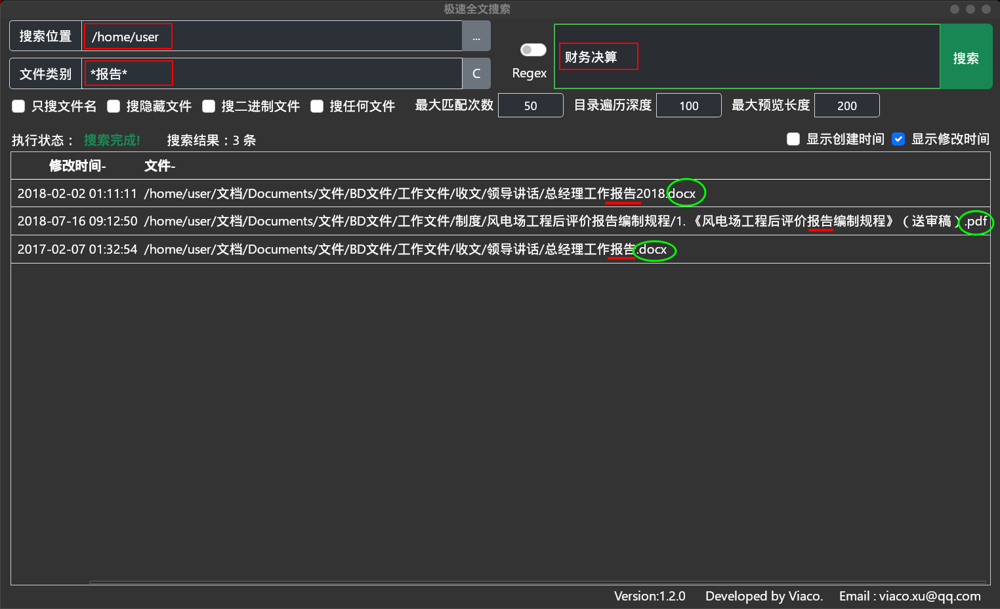

# 极速全文搜索

> 开发者：Viaco  
> 邮&emsp;件：viaco.xu@qq.com

无需知道**文件位置**或**文件名**，只需记得文件内的**某个词**或**几个字**，它就可帮你找到。

这是一款在海量硬盘数据里快速搜索文件内容的全文搜索软件，即**文件内容**搜索，也可用它搜文件名。可直接搜索zip内部文本而无需解压。可搜索的文件包括：**各种压缩文件、Office、电子书、SQLite、PDF、电影字幕，及其他任何文本文件**，甚至可搜索exe程序内部文本。


## 特点 

1. **无索引**

主流全文搜索软件都采用索引方式，索引体积几个G起步，且会不断增长。本软件无需索引。

2. **速度快**

本软件采用Rust语言开发，性能接近C语言。虽无法做到索引搜索的速度，但在无索引全文搜索中一定是非常快的。除了程序性能高，还因为它会调用全部CPU资源多线程、满负荷、并行搜索。

3. **高级搜索**

对普通用户，可以输入单个或多关键字组合搜索。对于高级用于可以使用正则表达式搜索。搭配文件类型通配符，可实现任何复杂的搜索逻辑。  <b style="color:red" >界面简约，但功能不简单！</b>

4. **结果齐全**

经与某主流全文搜索软件对比，相同关键字下，本软件搜索结果更多。

5. **跨平台** 

同时支持Windows和Linux操作系统。

6. **使用方便**

有使用不明白的地方，鼠标悬浮于相关位置，会弹出使用说明。

## 用法
### 1. 基本操作
【&emsp;&emsp;点击文件名】：打开文件  
【点击文件夹图标】：进入文件目录  
【&emsp;&emsp;&emsp;点击表头】：按命中次数、修改时间、创建时间、文件名排序  
【&emsp;&emsp;&emsp;鼠标停留】：显示相应帮助信息。在文件名上停留，显示命中关键字内容预览。  


### 2. 普通搜索

 【&emsp;搜索位置 】：Z盘根目录  
 【&emsp;文件类别 】：所有docx和pdf文件，但排除文件名中含“艺”字的文件。  
 【搜索关键字 】：[数学]  
 【&emsp;输出结果 】：找出了28个正文内包含“数学”的docx和pdf文件   

   

### 3. 管道搜索

 【&emsp;搜索位置 】：Z:\downnload  
 【&emsp;文件类别 】：未指定  [ 指定会更快 ]  
 【搜索关键字 】：[安全 节日 通知]，三关键字组合  
 【&emsp;输出结果 】：  

        1. 检测到多关键字组合搜索，自动启动管道搜索模式。
        2. 行状态可看出，在z:\download下找到29个包含“安全”的文件，在29个文件中找到4个包含“节日”的文件，从4个文件中找到3个儿包含“通知”的文件。同时包含三个关键字的文件最终只有3个。
        3. 把鼠标放到第二条搜索结果上，弹出结果预览信息。可以看到该文件中“安全”出现了16次，并摘取了3行提供预览；“节日”出现了2次，“通知”出现了1次。   

   

### 4. 正则搜索

 【&emsp;搜索位置 】：Z:\Program Files(x86)  
 【&emsp;文件类型 】：搜索所有docx、pdf和epub文件  
 【搜索关键字 】：正则表达式“\d{4}年\d{1,2}月\d{1,2}日”，表示：4位数+年+1或2位数+月+1或2位数+日，即搜日期。  
 【 输出结果 】：  

```
   1. 搜到92条内容包含日期的文件。  
   1. 把鼠标放到命中次数为6的结果上，弹出命中结果预览。可以看到日期分别在文件的Page1、Page10、Page36、Page38、Page42共出现了6次。  
```

   注意：<b style="color:red">要开启正则搜索，需勾选“Regex”复选框</b>


### 5. 文件名搜索

  【&emsp;搜索位置 】：Z:\  
  【&emsp;文件类别 】：未指定  
  【搜索关键字 】：[加强.*通知]  
  【&emsp;输出结果 】：把文件名中同时包含“加强”和“通知”，且“加强”在前“通知”在后的所有文件全部找出来了。

   注意：  
      <b style="color:red;">启用文件名搜索，须勾选“只搜索文件名”复选框。  </b>  详见下图。

   说明：  
         1. 文件名搜索默认支持正则表达式，正则表达式中英文句号**“.”**表示任意字符，星号**“\*”**表示前面的任意字符可以出现任意次。
         2. 所以**“加强.\*通知”**的意思就是：“**加强**”和“**通知**”之间可以出现任意字符，且数量不限。
         3. 如果不懂正则表达式，可以直接输入“**加强**”或“**通知**”即可。将把文件名包含“加强“或”通知“的所有文件找出来。

   

### 6. [文件名+文件内容] 组合搜索

搜索目的：  
希望在/home/user位置搜文件名包含“报告”的任何扩展名文件，文件内容包含“财务决算”的文件。

  【&emsp;搜索位置 】：/home/user 
  【&emsp;文件类别 】：[\*报告\*]  （如果只搜docx，则写为： \*报告\*.docx）  
  【搜索关键字 】：[财务决算]  
  【&emsp;输出结果 】：搜索结果的文件名全部包含了“报告”，且搜出了docx和pdf两种扩展名，鼠标停留在结果上可以看到，文件内容全部包含了“财务决算”。



### 7. 其他技巧

其中还包含了很多功能，请把鼠标悬浮到你想了解的功能位置，会有详细说明。

